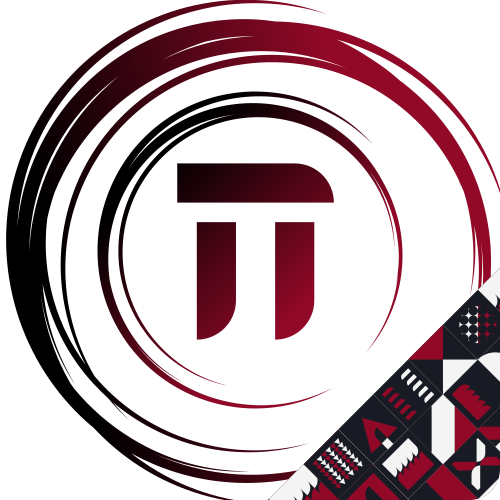

<h1>
  
  🔺Treinamento Técnico 2025.1🔺
</h1>

Este repositório é dedicado ao projeto construído pelos instrutores desenvolvedores do Treinamento Técnico de 2025.1 ofertado pela EJCM🏯.
Os projetos desenvolvidos ao longo do treinamento serão salvos em diferentes branchs. Também é possível visualizar os protótipos no Figma pelos links abaixo.

### 🔗Links

<!-- - [Protótipo no Figma](https://www.figma.com/) -->

<br/>
<br/>

## 🔺Sobre o Projetoℹ️🔺

### Prototipagem

O protótipo do projeto foi feito de forma incremental durante as aulas do **_Processo Seletivo de Design_** assim como a implementação foi feita durante
as aulas do **_Processo Seletivo de Desenvolvedor_**

## 🔺Desenvolvimento⚙️🔺

Os projetos consistem em aplicações feitas utilizando as tecnologias que fazem parte da Stack da EJCM, como ReactJS, NodeJS , TypeScript , Express  e WordPress . Buscamos com esse repositório abranger a maioria dos conceitos de desenvolvimento Web, frameworks e linguagens utilizadas, tais como **Componentização**, **Data Binding**, **Formulários**
**Rotas**, **API REST**, **Hooks**, **Controllers**, **Models**, **Modelagem BD**, etc.
<br/>
<br/>

# Instruções

## Dependência de Desenvolvedor

Após clonar o repositório ou, caso já tenha clonado, atualize-o com

```
- git fetch
- git pull origin main
```

Feito isso, para instalar todas as dependências do seu projeto
